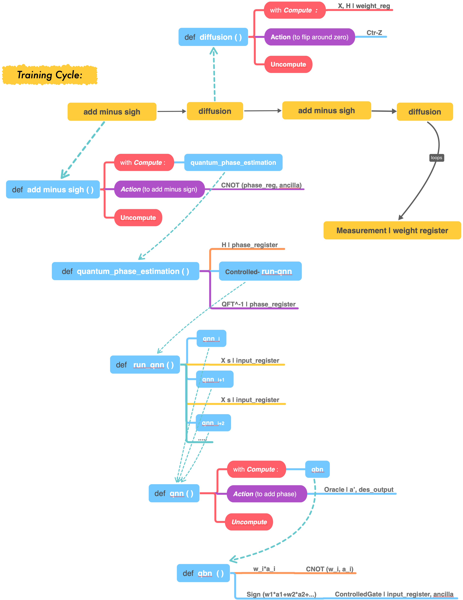
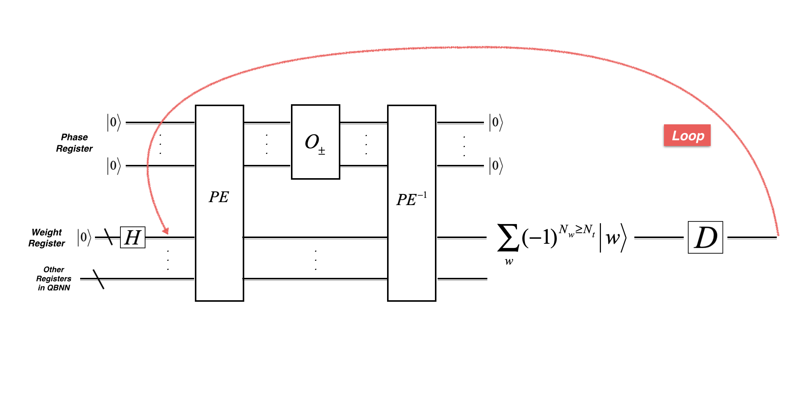
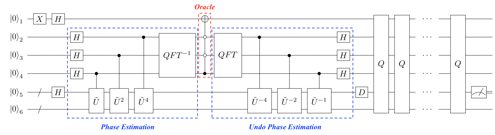
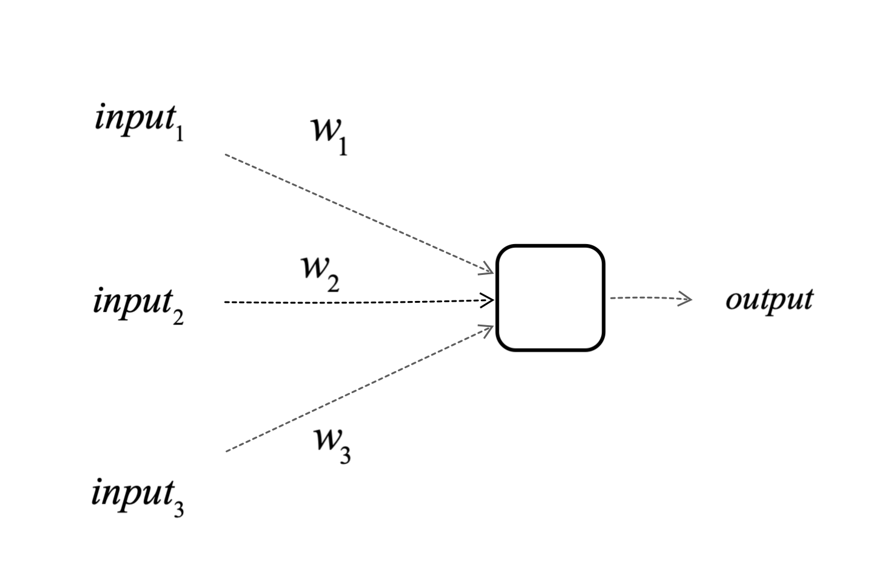
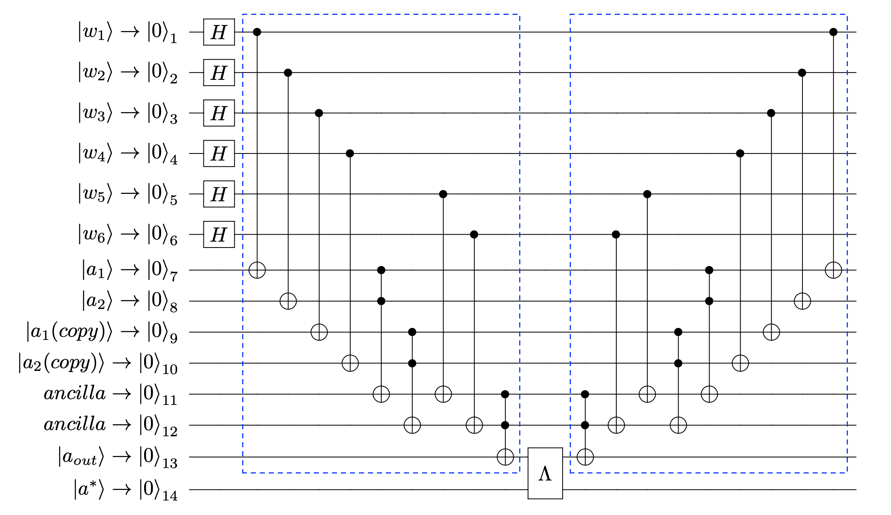
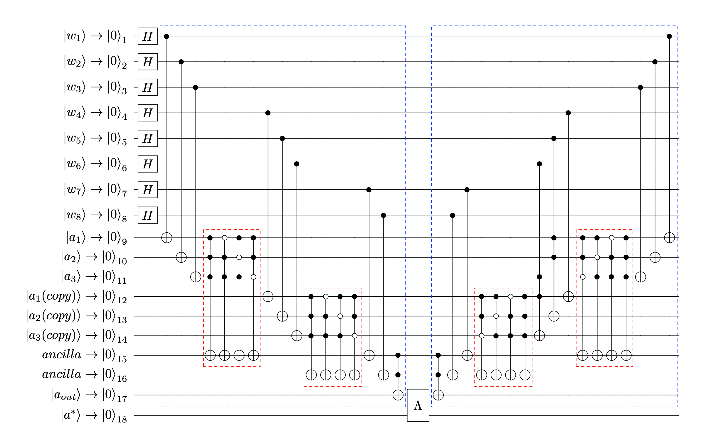
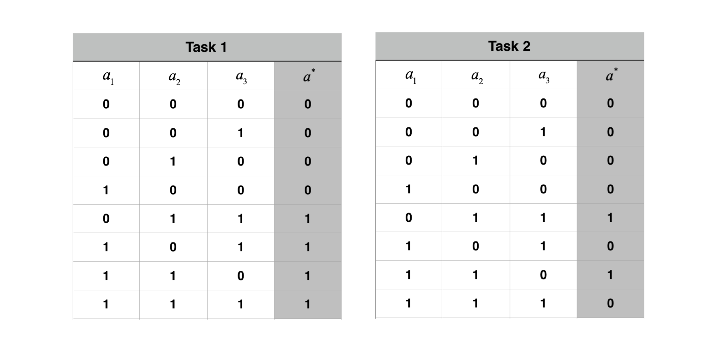
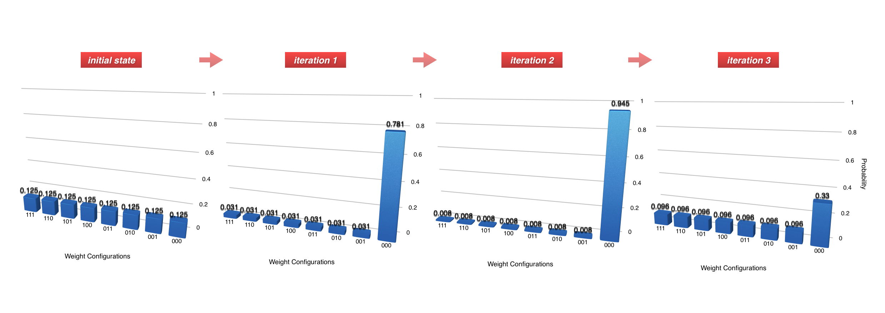
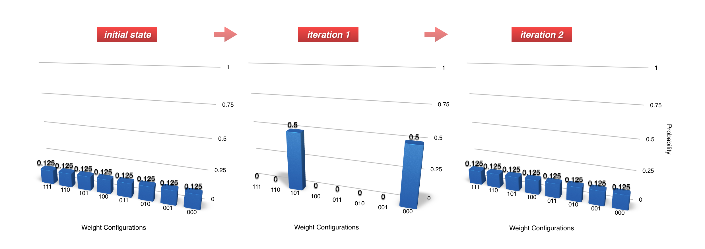
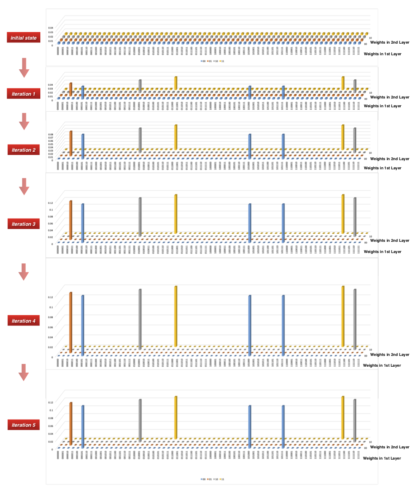

Quantum Binary Neural Network
==================================================================
This repo is supplementary to our paper: https://arxiv.org/abs/1810.12948, 
presenting the code implementations of QBNN examples.

The implementations are done on Huawei's Quantum Computing Platform "HiQ" : http://hiq.huaweicloud.com/en/index.html

The hierachy of the code can be illustrated as follow:

All the implementation examples execute the following generic training cycle:

The details of each block can be seen below: 

The QBNN Examples with the corresponding quantum circuits are:

【Example 1.】 Single neuron with 2 weights and 2 inputs:

.. image:: circuits/Example_1_QBN_Circuit.png

【Example 2.】 Single neuron with 3 weights and 3 inputs:

【Example 3.】 3-layer Neural Network with 6 weights, 2 inputs and 1 ouput: 

【Example 4.】 3-layer Neural Network with 8 weights, 2 inputs and 1 ouput:  

     
For the QBN in Example 2 and QBNN in Example 4, we consider the following two tasks:

When we apply task 1  to QBN in example 2, we see the weight state evolution over iterations: 

When we apply task 2 to QBN in example 2, we see the weight state evolution over iterations:

For the QBNN in Example 3, we use the same training set as stated in Example 1. The weight state evolution during the training iterations is:

.. image:: results/weight_state_evolution_Example_3.png

Similarly, we trained the QBNN in Example 4 with the two tasks. For instance,the weight state evolution of the training with task 2:

**The state evolutions generated by the QBNN training cycles match the amplitude amplification of standard Grover's algorithm. This does not only imply the marking of the optimal weights is precise, but also indicates that the decoupling of the weights by the uncomputations succeed. 

The probability of success (The probability of obtaining an optimal weights) over iterations for the two tasks respectively:

.. image:: results/Probability_of_Success_Example_4.png
