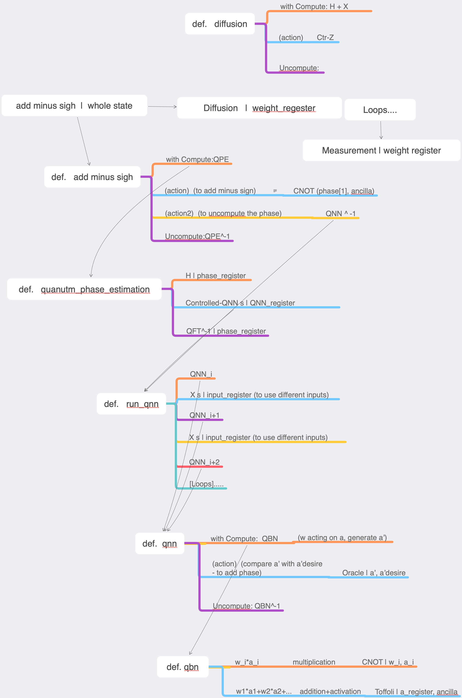

Quantum Binary Neural Network
==================================================================
This repo is supplementary to our paper: https://arxiv.org/abs/1810.12948, 
presenting the code implementations of QBNN examples.

The implementations are done on Huawei's Quantum Computing Platform "HiQ" : http://hiq.huaweicloud.com/en/index.html

.. image:: docs/images/braket_notation.svg
    
.. image:: circuits/Example 1 QBN Circuit.png

    :alt: Rx(theta)|qubit>
    :width: 100px

The framework is shown below:

